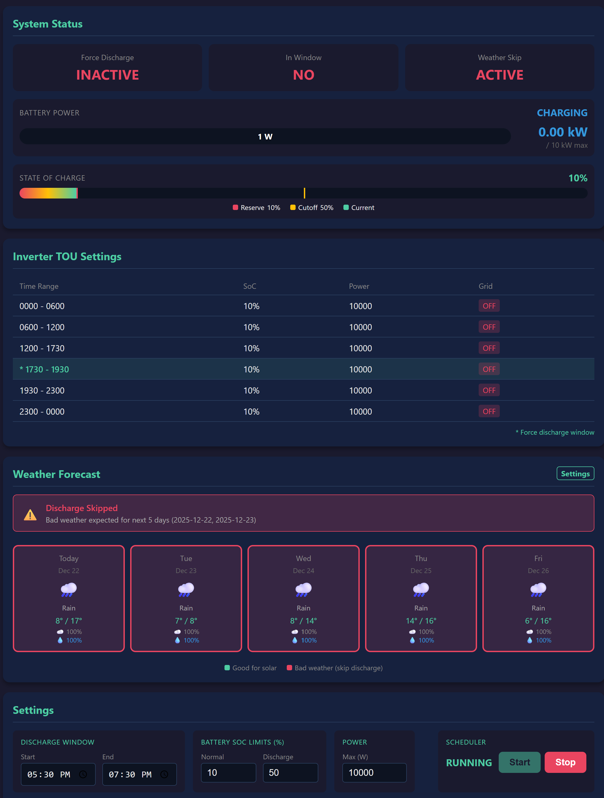

# Deye Force Discharger

A Python application to automate battery discharge scheduling for Deye hybrid inverters via the Deye Cloud API.



## Background

This project was built for **AC-coupled Deye hybrid inverter setups** where solar input comes from a separate inverter.

In this configuration, the Deye inverter typically operates in **"Zero Export to CT"** mode to:

- Power household loads from the battery
- Charge the battery from the AC-coupled solar system

When running in "Zero Export to CT" mode, the inverter does not allow force battery discharge to the grid. This means you cannot export stored battery energy during peak electricity pricing windows.

## How It Works

The scheduler monitors the current time and battery SoC, controlling both the work mode and TOU settings:

1. **Within discharge window** (e.g., 17:30-19:30) **and SoC above cutoff**:
   - Switches to `SELLING_FIRST` mode
   - Sets TOU window SoC to the cutoff value (e.g., 50%)
   - Battery discharges to grid until cutoff is reached

2. **Outside window or SoC at/below cutoff**:
   - Switches to `ZERO_EXPORT_TO_CT` mode
   - Sets TOU SoC to reserve value (e.g., 20%) for all periods
   - Normal zero-export operation resumes

## Requirements

- Python 3.11+
- Deye Cloud developer account (API credentials)
- Deye hybrid inverter with battery storage

## Configuration

Edit `config.json` with your credentials and preferences:

```json
{
  "deye": {
    "api_base_url": "https://eu1-developer.deyecloud.com",
    "app_id": "YOUR_APP_ID",
    "app_secret": "YOUR_APP_SECRET",
    "email": "your@email.com",
    "password": "YOUR_PASSWORD",
    "device_sn": "YOUR_DEVICE_SERIAL"
  },
  "schedule": {
    "force_discharge_start": "17:30",
    "force_discharge_end": "19:30",
    "min_soc_reserve": 20,
    "force_discharge_cutoff_soc": 50,
    "max_discharge_power": 10000
  }
}
```

### Configuration Options

| Field | Description |
|-------|-------------|
| `api_base_url` | Deye Cloud API endpoint (varies by region) |
| `app_id` | Your Deye Cloud app ID |
| `app_secret` | Your Deye Cloud app secret |
| `email` | Deye Cloud account email |
| `password` | Your Deye Cloud password |
| `device_sn` | Your inverter serial number |
| `force_discharge_start` | Start time for force discharge (HH:MM) |
| `force_discharge_end` | End time for force discharge (HH:MM) |
| `min_soc_reserve` | Minimum battery SoC reserve (used outside discharge window) |
| `force_discharge_cutoff_soc` | SoC at which to stop force discharge (e.g., 50%) |
| `max_discharge_power` | Maximum discharge power in watts (e.g., 10000) |

## Installation

```bash
# Edit configuration
vi config.json

# Start the container
docker-compose up -d
```

## Usage

The web interface is available at `http://<server_ip>:7777`

## Getting Deye Cloud API Credentials

1. Register at [Deye Cloud Developer Portal](https://developer.deyecloud.com)
2. Create an application to get your `app_id` and `app_secret`
3. Find your device serial number in the Deye app or on the inverter

## Android Widget 

I've also created an Android app for this and some extra features like show SoC & charge/discharge status in 1x1 widget. 

Worth consider if you don't have a place to host this. 

Drop me an email if you want to be a tester. (logan_at_han.life)
